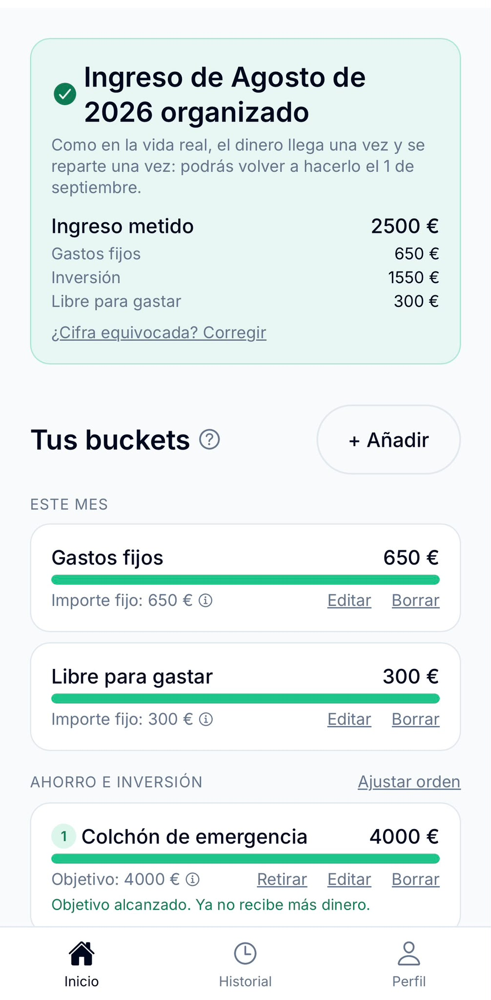
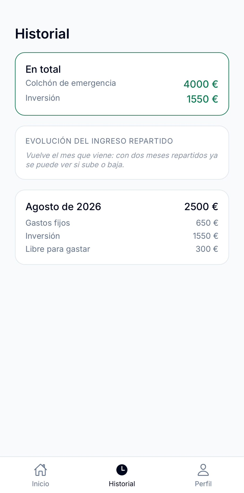
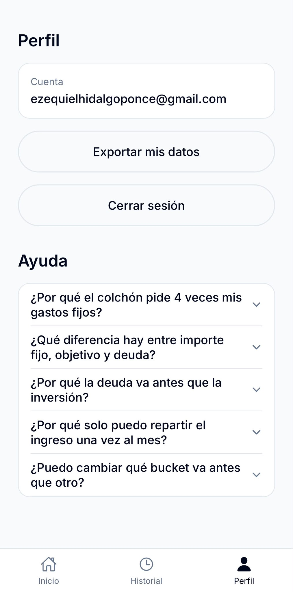

# Kubo

App de gestión financiera personal automatizada. En vez de categorizar gastos a posteriori (tipo Fintonic), Kubo reparte el ingreso mensual entre "buckets" (cubos) siguiendo una cascada de prioridad fija, en el momento en que el dinero llega.

**🔗 Pruébala:** [kubo-finanzas.vercel.app](https://kubo-finanzas.vercel.app) (versión web, funciona igual en desktop y móvil)

<p align="center">
  
  
  
</p>

## Diferencia con Fintonic y apps similares

Apps como Fintonic, YNAB o Money Lover funcionan **a posteriori**: te conectas las cuentas, gastas con normalidad, y la app **categoriza** cada movimiento que ya ocurrió ("esto es ocio", "esto es comida") para darte estadísticas de en qué se te fue el dinero. Es una fotografía del pasado, no decide nada por ti, tú sigues gastando libremente y luego revisas.

Kubo funciona **a priori**, en el momento en que entra el ingreso: en vez de dejar que el dinero se gaste libremente y clasificar el rastro después, reparte automáticamente el ingreso mensual completo en el momento en que llega, siguiendo una cascada de prioridad fija. No dice "en qué gastaste", dice "esto es lo que le toca a cada cubo este mes", antes de que se pueda gastar.

Dicho de otra forma: Fintonic es un espejo retrovisor (categorización descriptiva), Kubo es un motor de reglas prescriptivo (asignación automática por prioridad).

## Cascada de reparto

1. **Gastos fijos**: importe fijo cada mes.
2. **Colchón de emergencia**: objetivo configurable (4x gastos fijos por defecto).
3. **Deuda** (si existe): se prioriza sobre la inversión, porque casi ninguna inversión rinde más que el interés de una deuda.
4. **Inversión**: se lleva el resto.
5. **Libre para gastar**: garantizado, igual que los gastos fijos.

**Límite legal:** Kubo solo calcula cifras de reparto. Nunca recomienda activos/productos concretos ni asume rentabilidades de inversión, eso es asesoramiento financiero regulado y queda fuera de alcance del proyecto.

## Stack

- **Backend:** Python 3.12 + FastAPI + Pydantic v2 + SQLAlchemy 2.0 + Alembic, desplegado en [Render](https://render.com)
- **Base de datos:** PostgreSQL, alojada en [Neon](https://neon.tech)
- **App móvil/web:** Expo (React Native + TypeScript), build web desplegado en [Vercel](https://vercel.com)
- **Auth:** [Clerk](https://clerk.com) (email/contraseña + Google)
- **Infra dev:** Docker Compose

### Qué hace cada pieza del backend

- **FastAPI**: la API web, la "puerta de entrada" que recibe peticiones HTTP y devuelve respuestas en JSON.
- **Pydantic**: valida que los datos que entran/salen de la API tengan la forma correcta.
- **SQLAlchemy**: el ORM (Object-Relational Mapper), traduce entre tablas SQL y objetos Python, para no escribir SQL a mano (menos errores, evita inyección SQL).
- **Alembic**: el "Git de la base de datos", versiona cada cambio de estructura (tablas, columnas) en scripts aplicables y reversibles, usando las clases de SQLAlchemy para detectar los cambios.

## Regla de dinero: todo en céntimos, nunca float

Los números decimales (`float`) no representan el dinero con exactitud, porque los ordenadores guardan los decimales en binario y arrastran pequeños errores de redondeo:

```python
>>> 0.1 + 0.2
0.30000000000000004
```

Para evitarlo, todos los importes se guardan como **enteros que representan céntimos**, nunca euros con decimales:

- 3.000€ → `300000` (int)
- 12,50€ → `1250` (int)

Los enteros no tienen errores de redondeo. Solo se divide entre 100 al mostrar el importe en pantalla; internamente nunca se opera con decimales. Por eso los campos se llaman `*_cents` y no `*_euros`.

Además, el ledger (registro de movimientos) es **append-only**: nunca se hace `UPDATE` sobre un asiento existente, solo se añaden asientos nuevos de reversión si hay que corregir algo. Así queda todo el histórico auditable.

## Motor de allocation (`motor/`)

Núcleo puro en Python, sin dependencias de HTTP ni base de datos, se puede probar con tests unitarios aislados.

**`BucketStrategy`**: las 3 formas en que un bucket puede recibir dinero en la cascada.

- `FIXED`: importe fijo cada mes, siempre el mismo (ej. gastos fijos). Requiere `fixed_amount_cents`.
- `FILL_TO_TARGET`: se rellena hasta un objetivo y deja de recibir dinero al alcanzarlo (ej. colchón). Requiere `target_cents > 0`.
- `REMAINDER`: se lleva todo lo que sobre después de los cubos anteriores (ej. inversión). No necesita ni objetivo ni importe fijo, su cantidad se calcula.

**`Bucket`**: definición inmutable de un cubo (la regla, ej. "el colchón tiene objetivo 4.000€"). Valida en `__post_init__` que cada estrategia tenga el dato que necesita.

**`AllocationResult`**: resumen completo del reparto de un ingreso mensual entre todos los buckets. `unallocated_cents` debería ser siempre `0`; si no lo es, hay un error en el cálculo.

## API y base de datos (`app/`)

### Endpoints

- `GET /health`: comprobación de que la API está viva.
- `POST /buckets` / `GET /buckets` / `PUT /buckets/{id}` / `DELETE /buckets/{id}`: CRUD de buckets.
- `POST /allocate`: ejecuta un reparto real.
  1. Lee los buckets guardados y calcula el saldo actual de cada uno sumando `ledger_entries`.
  2. Convierte cada fila de la base de datos a un `Bucket` del motor puro (`motor.models`), que no depende de la base de datos ni de FastAPI.
  3. Llama a `motor.engine.allocate(...)`, la misma función probada con tests, reutilizada tal cual.
  4. Guarda el resultado como nuevas filas en `ledger_entries` (append-only) y devuelve el desglose completo.

### Autenticación (Clerk)

Todos los endpoints salvo `/health` requieren un token válido en la cabecera `Authorization: Bearer <token>`, emitido por Clerk. `app/auth.py` verifica el token de cada petición y corta con `401` si no es válido.

**Multiusuario:** `buckets` tiene clave primaria compuesta `(user_id, id)`, y todas las consultas filtran explícitamente por el `user_id` del token: un usuario nunca puede ver ni modificar los buckets de otro.

## App móvil/web (`app-movil/`)

Proyecto Expo (React Native + TypeScript) compartido entre iOS, Android y web (`react-native-web`). Interfaz propia sin componentes prediseñados. Sistema de diseño centralizado en `theme.ts`: paleta Navy `#01081D` + Emerald `#22C58B` (reservado a progreso y confirmaciones), tipografía Inter, cero sombras.

## Cómo levantar el proyecto en local

**Motor puro (sin dependencias externas):**

```bash
python -m pip install pytest
python -m pytest -v
```

**API + base de datos:**

```bash
docker compose up -d --build
python -m alembic upgrade head    # aplica las migraciones
```

La API queda en `http://127.0.0.1:8000`, documentación interactiva en `/docs`.

**App móvil/web:**

```bash
cd app-movil
npm install
npx expo start --web    # o sin --web + Expo Go en el móvil
```

## Convenciones

- Código (clases, funciones, variables): inglés.
- Commits, branches, PRs, comentarios de código y conversación: español.
- Commits: Conventional Commits en español, sin emojis.
- Branches: `feat/motor-allocation`, etc.
